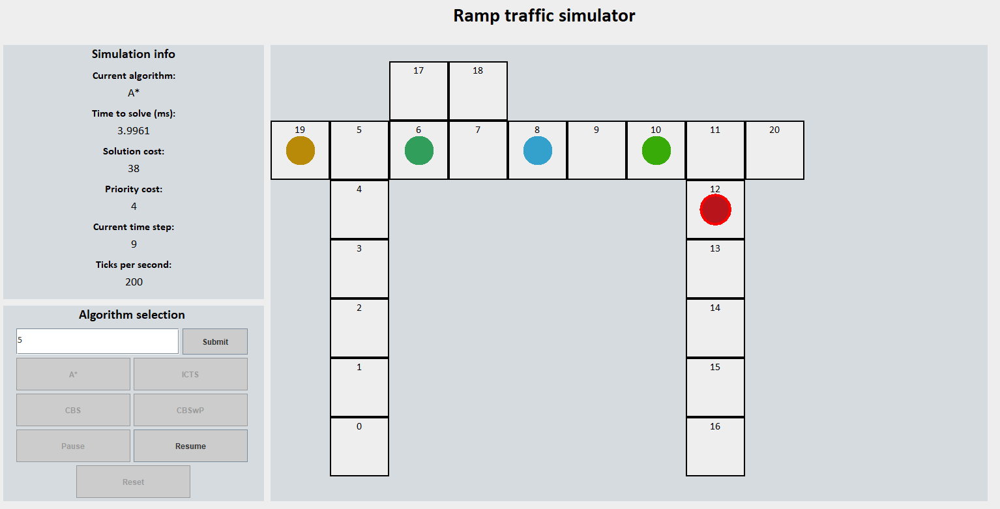

# Mining Ramp Traffic Simulator

	

## Introduction
This program simulates a mining ramp. A mining ramp is a ramp used by mining vehicles, either those from the surface wanting to reach the mine or those from the mine wanting to return to the surface. The mining vehicles can enter the scenario at different times throughout its lifespan. Whenever a vehicle tries to use the ramp, it must first join through either of the ramp's queues - the surface queue or the underground queue - depending on the vehicle's direction. The goal for each vehicle is to reach the opposite end of the ramp from where it started.

As mentioned, the scenario has a lifespan. Within this lifespan lifespan, the scenario checks if new vehicles will enter the ramp, in which case it puts the vehicles in their respective queues. The scenario ends as soon as (1) all vehicles have reached their destinations, and (2) the lifespan lifespan has expired.

The following list includes the main constraints of the scenario:
1. The ramp only has one lane, which is the main bottlenect. This means to no two oncoming vehicles can pass by each other. To alleviate this bottleneck, so-called passing bays can be placed throughout the ramp to allow oncoming vehicles to pass. A passing bay can fit at most one vehicle at a time.
2. Whereas agents are allowed to wait inside a passing bay, they may not wait or turn directions whilst on the ramp itself.
3. Some vehicles must never stop once they enter the ramp. Such vehicles are therefore not able to enter passing bays, meaning that any oncoming vehicles must give way, either by staying in the queue or, if it has already entered the ramp, by occupying a passing bay.
4. Implied by the previous constraint is that some vehicles have higher priority than others. In a practical scenario, such a prioritised vehicle might be one that carries workers to the underground whenever they are urgently needed, or one that is heading to the surface when the mine suffers lack of space.
5. The queues must maintain a valid queue behaviour. More specifically, if an agent inside the queue stays in the same vertex with the vertex in fron being free, this is an invalid behaviour. All vehicles must always move forward if such a move is possible inside the queue.

## User Controls

The software gives the user ability to control the features of the mining ramp, the vehicles and their properties, and the scenario lifespan. The mining ramp has the following adjustable properties:
+ Length
+ Passing bays and their locations
+ Queue lengths

Each vehicle has the following adjustable properties:
+ Direction of travel
+ Ability to use passing bays
+ Priority status
+ Velocity (a bit misleading since only `velocity = 1` works in this version)

As is explained later, the user decides what algorithms to apply on a scenario. Whenever the algorithms are finished computing, a UI appears which allows the user to graphically see the solutions of the algorithms time step by time step.

## Algorithms

The algorithms implemented in this software closely follows those described in their respective original papers. Due to the extensive constraints and bottlenecks of the mining ramp scenario, however, the algorithm have been modified to be compatible with the scenario. More specifically, the algorithms have been extended to conform to the constraints listed in the introduction.

### A*

The first algorithm is an ordinary A\* extended to work with multiple vehicles (heceforth referred to as agents). There are two frequently seen extensions of multi-agent A\*: [Operator Decomposition and Independence Detection](	https://doi.org/10.1609/aaai.v24i1.7564 ). Neither of these are implemented due to the limited benefit they would add in this scenario.

### Increasing Cost Tree Search (ICTS)

The Increasing Cost Tree Search (ICTS) algorithm is an optimal two-level search algorithm. It works by trying to find an optimal conflict-free solution by iteratively increasing the allowed path cost of each agent. It starts off by computing the optimal path cost for each agent as if they were alone on the mining ramp. Starting with these acquired cost values, ICTS continues to increase the path costs until a solution is found.

#### Reference

- [The increasing cost tree search for optimal multi-agent pathfinding](https://doi.org/10.1016/j.artint.2012.11.006)

### Conflict-Based Search (CBS)

Conflict-Based Search (CBS) is also an optimal two-level algorithm. It works by treating the agents as if they are alone on the mining ramp, to find a path for them to their destinations. It then simulates the agents executing their plans and stops as soon as a conflict between two agents is encountered. Following a conflict, CBS imposes constraints on both involved agent and thus entertains both possibilities following the conflict: one where the first agent is prohibited from taking the conflict-inducing action, and one where the other agent is instead prohibited. With these constraints the affected agents now take slightly different paths in the hopes of avoiding any further conflicts. This process continues until all agents successfully reach their destinations.

#### Reference

- [Conflict-based search for optimal multi-agent pathfinding](https://doi.org/10.1016/j.artint.2014.11.006)

### Conflict-Based Search with Priorities (CBSw/P)

Conflict-Based Search with Priorities (CBSw/P) works very similar to the traditional CBS. Here, however, the way in which constraints are imposed on the agents are always consistent by constructing a priority ordering between the agents. Following a conflict, the constraints added to the agents imply a priority difference between the involved agents. If a later conflict occurs between the same agents, the constraint must be imposed on the same agent as in the first conflict between them, that later resulted in this conflict happening. Because of this behaviour, CBSw/P does not always impose constraints on both involved agents (if doing so would violate the priority ordering), hence why all possibilities following a conflict are not always explored. Therefore, CBSw/P is not optimal but generally finds a solution faster than ordinary CBS since less possibilities are explored.

#### Reference

- [Searching with Consistent Prioritization for Multi-Agent Path Finding]( 	
https://doi.org/10.48550/arXiv.1812.06356)

## How to Run the Program (The Flow of Running the Software)
First and foremost, this software has not been optimised. Although the algorithms work, there is room for improvement in terms of performance, error-handling etc. Due to the limited scope of the course in which this project was conducted, the final product is not as polished as it might have been would the course have been longer. Nonetheless, it was a tremendous learning experience and something I look back on fondly.

The main file in its current state contains the code of an example case and should be able to run without having to do anything. The software in its current state is not fail-safe in that it requires the user to make decisions that make sense. For instance, the user can technically put passing bays outside of the ramp but it will make no sense. In other cases, the software might crash if the user input is illogical or not allowed.

### Designing the Ramp
The Ramp is represented as a Ramp object with four parameters:

- The ramp length
- The surface queue length
- The underground (mining) queue length
- An array of locations at which passing bays are to be located

Each location in the array represents the ramp vertex next to which the passing bay starts. For instance, if the array is `[5]`, one passing bay will be constructed next to the fifth and sixth vertex counting from the surface.

### Designing the Agents and Their Arrivals to the Ramp
An agent is represented as an Agent object with five parameters:

- An identifier (must be unique)
- Velocity (has no effect)
- Direction
- Ability to use passing bays
- Priority status

In order for an agent to be included in the scenario, it must first be added to an AgentEntries object. The AgentEntries object represents a schedule of at what time steps different agents will enter the mining ramp scenario.

### Creating a Scenario
The way the software currently works, each algorithm requires its own scenario to work. Thus, if one wants all four algorithms to run on the scenario, four identical scenarios must be created. A scenario is represented as a MAPFScenario which takes three parameters:

- A Ramp object
- An AgentEntries object
- The lifespan lifespan of the scenario

### Invoking the Algorithms
Before an algorithm is invoked to solve the scenario problem, a MAPFSolver object must be created. The MAPFSolver constitutes the heart of the MAPF-solving machinery as it is the entity responsible for employing algorithms on its scenario. Its `solve()` method then returns the solution generated by the employed algorithm as a MAPFSolution object. If one wants the algorithm to prioritise higher priority agents, the user must set the prioritise parameter of solve() to true, else false. The MAPFSolver object takes two parameters:

- A MAPFScenario object
- A string representation of the algorithm to employ (`"astar"`, `"icts"`, `"cbs"`, or `"cbswp"`)

### The User Interface
The UI is represented as a visualiser object with multiple parameters:

- The Ramp object
- A solution (MAPFSolution) from A\*
- A solution (MAPFSolution) from ICTS
- A solution (MAPFSolution) from CBS
- A solution (MAPFSolution) from CBSw/P

The visualiser expects a solution from every algorithm. That said, if certain algorithms have not been invoked on a current scenario, they should be set to null.

The UI gives the user a graphical overview of the scenario along with statistics for the current solution being shown. The UI is also interactive in that the user determines what solution to show, and how fast. The user can pause, resume and reset a solution being shown.

The agents are represented as filled circles where an agent occupies one vertex per time step. A red frame around the agent circle represents that the agent is of higher priority.
